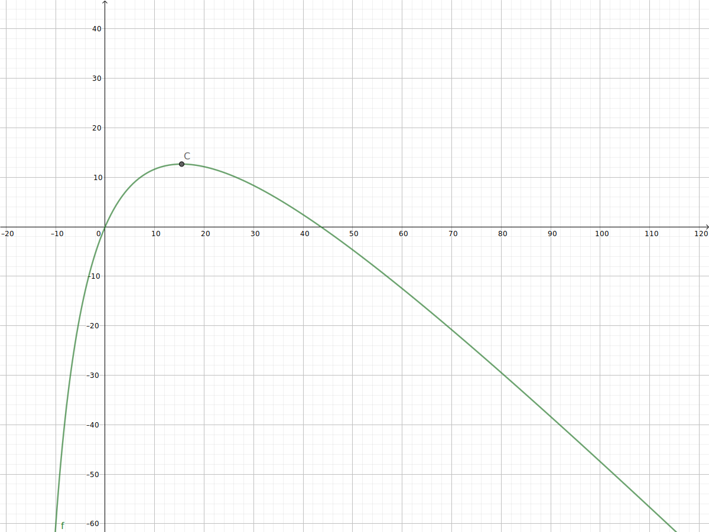

## v3.2
调整方向，大方向是在defi和cefi之间套利。这样大资金才能赚到利润。
另外现在监控内存池，在别人之前买入拉高价格，在别人之后卖出，再赚差价。


## v3.1.2
#### 已解决的问题：
1. 合约支持数组参数，可以传递任意步骤的套利流程。

1. 新增三角套利的价差发现。目前搬砖和三角套利的阈值分别是1%和3%。
1. 发现价差后，提前通过js实现的swap方法计算最终产出是否有利润。jvm计算该脚本的gas。如果 "利润 > gas*gasPrice" 就发出交易。
1. 合约增加了 块高、时间、每一步的预期产出 参数，通过这些条件可以提前终止合约减少手续费的浪费。如这个[交易](https://etherscan.io/tx/0x0bf8cc68e46d9ffa2c3b8bacb6db9e5220b1f15f3e2c725fdeb33a73f5bce5c0)

#### 目前存在的问题：
1. 上面3中提到的gasPrice是通过web3.eth.getGasPrice获取的，这个值是推荐值，不能满足后面的需要。
1. 其他套利者他们有一些省手续费的[操作](https://etherscan.io/tx/0x539b8c06a08ba89c0f40d732084773142c42af46fb9ac663b219fc567df94d66)。当他们发现交易过时会重新发一个很高gasPrice的交易，并且参数为0x，这样他们能在出块前不断的覆盖老交易，或者发出价格更高的套利交易。
1. 套利的最佳金额需要求极值，例如两步的uniswap套利交易，对应这个公式：

        ```y = r(r*x*b / (a+r*x))c / (d+r(r*x*b / (a+r*x))) - x
        r = 0.997
        a/b c/d 两个交易对的存量
        x 投入的eth数量
        y 利润```
    
    目前是通过循环找出最大值就break了。
    
1. 由于没有监控内存池信息，导致我们发出的交易不具有竞争力。
1. 竞争非常激烈，为了成为入块的第一笔交易，手续费占了利润的绝大部分。

    昨晚我们发出了一笔```205Gwei```的高手续费DAI/WETH[套利交易](https://etherscan.io/tx/0x6fdf68a1b9caa88d9dd2a666332fc1c719b46a326add210699731185b5f58eff)
    
    由于当时差价足够大，程序计算得出可以100%余额投入。按照当时余额17个weth计算得出：
    
        预期收益0.095665202ETH，手续费0.05643ETH，纯利润为0.039ETH。
    但我们的交易发出之后被别人抢先了，对方用```1409Gwei```交易占了入块的第一个[交易](https://etherscan.io/tx/0xf0637e5c535d2640f4cda6686153a2e0375978a05305e4940de23acc004b67da):
    
        他们套利毛利264DAI，手续费高达0.2924ETH (约等于204.5608DAI)，利润60DAI。
        
    所以我们的交易最终无法成功，返回rever。浪费了手续费 0.05643ETH。

1. 我们大部分时候没法套利，对方源源不断的发交易。已知原因是他们交易对监控很多，支持的协议更多。并且对gas对预估准确。
    
#### 存在问题的解决方案：
1. 需要监控内存池的交易，出价要高过所有人。
2. 如果入块的交易取决于矿池而不是交易费高低，我们可以自己打包自己的交易在第一位（不知是否可行）
3. 不仅出价要高，还要不断监控是不是有人更高，出现这种情况还需要覆盖已有的交易。
    

## 价格监控 v3.1
在搬砖的基础上，实现了三角套利。不过目前的三角套利发现机制算法不完美，会有概率错过发现。
合约已经实现了N步骤套利，根据参数随意指挥。
目前主要是gas、手续费、滑点的预估。这块还有优化空间
另外如果机会丢失或者新机会出现，可以做覆盖操作，用于撤销前向堵着的交易。


## 价格监控 v3 
在v2版本，实现了uniswap协议和三大交易所的价格抓取。
但是在要引入balancer的时候遇到了问题。balancer可以有无数多的池，并且允许同样的交易对存在。之前的设计无法兼容。
现在重新修改quote表，引入协议信息，代码上根据不同的协议做不同的事情。下面列举已经支持的3个协议区别。

1. cefi 最简单，通过相关http api获取价格信息，严格区分pair的顺序
1. uniswap 目前支持uniswapV2、sushiswap，pair的顺序根据合约不定，需要特殊处理。
1. balancer 会有N多池子，每个池子可能2-8个token，每个池子最大产生28个交易对信息。

价格依然通过socket传递，但是也要新增一个price表（用于保存最新的价格信息），和之前不一样的地方在于，现在会翻转pair的价格，也就是会同时存eth/usdt usdt/eth两行数据。
这个版本把合约地址带入数据库管理，并且对同样对合约，使用同一个abi，减少配置大小，也更加统一。

模块准备进一步拆分，会有一个socket的内存数据中心，web服务，抓取服务（cefi和defi拆分，cefi轮询，defi监控出块然后获取最新状态）。

统一规范，本系统内所有的交易对，```AAA/BBB = N``` 都意义是指一个AAA由BBB计价，如果```eth/usdt = 543.40```,代表一个eth，需要543.3个usdt

### 套利方式

#### 1. 搬砖套利
这种方式目前主要是在两个交易对之间做，且需要有本金。 如我有eth， 可以在两个不同的交易所之间做 eth/usdt的套利，最后换回eth。
例如 ETH -> USDT(甲交易所), USDT -> ETH(乙交易所)

#### 2. 三方搬砖套利
这种方式和搬砖类似，不过我并不持有任何一种token。此时需要我通过eth额外购买/闪贷其中一种token，再利上面的规则套利一圈，再卖成eth。
例如一 ETH -> ATOKEN, ATOKEN -> BTOKEN(甲交易所), BTOKEN -> ATOKEN(乙交易所), ATOKEN -> ETH
例如二 闪贷ATOKEN, ATOKEN -> BTOKEN(甲交易所), BTOKEN -> ATOKEN(乙交易所), 归还ATOKEN, 剩余ATOKEN -> ETH

#### 3. 三角套利
这个就是在3个quote之间流转一圈，实现套利。
例如 ETH -> ATOKEN, ATOKEN -> BTOKEN, BTOKEN -> ETH


### 合约的实现

暂时的想法是，合约提供step数组参数，合约内置支持uniswap、balancer两种交易方式。
合约内通过step 一步一步的执行计划，完成套利。
```javascript
//以下是两步套利的参数，每一步是5个参数，展开成10个参数的函数。
a2(
//protocol, exchangeContractAddress, fromToken, toToken, tradeAmount
'balancer', cc.exchange.balancer['0x7afe74ae3c19f070c109a38c286684256adc656c'].address, cc.token.weth.address, cc.token.dai.address, web3.utils.toWei("2", 'ether'),
'uniswap', cc.exchange.uniswap.router02.address, cc.token.dai.address, cc.token.weth.address, "0"
)
```


## 价格监控 v2
由于要同时监控DeFi和CeFi，所以之前的设计有些问题。
老的设计只监控了uni和sushi，同时强制绑定了他们同样的交易对为一组。
现在按照主流的规则 Token/MasterToken，例如dai/eth这种方式统一各个数据，交易所已经是标准做法。DeFi上面各不相同。
前端也要改成拖拽+随意组合的方式，方便同时观察多组数据在时间维度上的情况。

之前使用的LowDB,现在需要采用MySQL。

准备实现的交易对如下，主观按照重要程度排序

### CeFi
1. BTC/USDT
1. ETH/BTC
1. DAI/ETH

### DeFi
1. WBTC/ETH
1. USDT/ETH
1. USDC/ETH
1. DAI/ETH
1. LEND/ETH
1. ....
1. YFI
1. UNI
1. COMP


## 价格监控 v1
最早的版本，使用lowdb，监控了uniswap+sushiswap，当时发现要么两边价格一样，要么其中一边流动性不足。
并且没有差价发现机制。


